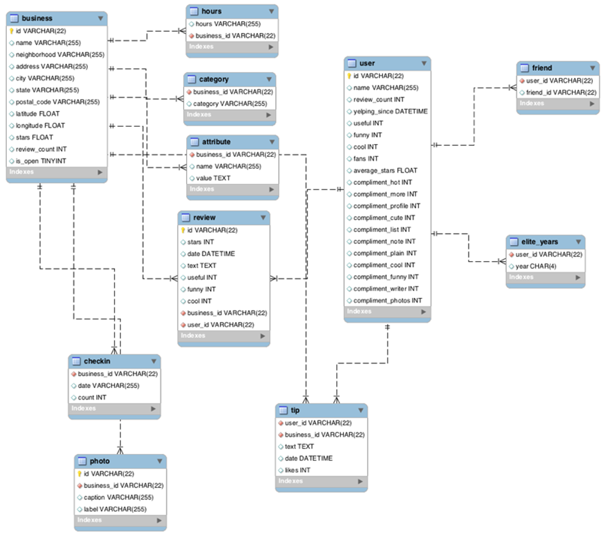

# Final exercise course 
### SQL for Data Science - Coursera 2021 - University of California, Davis 

As the final exercise in the course SQL for Data Science. This assignment is designed to test the knowledge of a wide range of concepts and SQL design techniques discussed throughout the course. Using a dataset from a US-based organization called <a href="https://www.yelp.com/dataset" target="blank">Yelp Open Dataset</a> , which provides a platform for users to provide reviews and rate their interactions with a variety of organizations – businesses, restaurants, health clubs, hospitals, local governmental offices, charitable organizations, etc. Yelp has made a portion of this data available for personal, educational, and academic purposes. Check out the Yelp Dataset ER Diagram and instructions below for more detailed information on the dataset and how was completed the assignment.

## Yelp Dataset ER Diagram

The entity relationship (ER) diagram below, should help familiarize you with the design of the Yelp Dataset provided for this peer review activity.

<h2 style="color:#0080c0">First Part</h2>

you are asked a series of questions that will help you profile and understand the data just like a data scientist would. For this first part of the assignment, you will be assessed both on the correctness of your findings, as well as the code you used to arrive at your answer. You will be graded on how easy your code is to read, so remember to use proper formatting and comments where necessary.

<h4 style="color:#0080c0">1. Profile the data by finding the total number of records for each of the tables below:</h4>

<a>Answer:</a> The dataset have 11 tables with 10.000 rows every each.

SQL code used to arrive at answer:

<xmp>
SELECT COUNT(*) 
FROM "name of the table"
</xmp>

# Part 2

you are asked to come up with your own inferences and analysis of the data for a particular question you want to answer. You will be required to prepare the dataset for the analysis you choose to do. As with the first part, you will be graded, in part, on how easy your code is to read, so use proper formatting and comments to illustrate your intent as required.